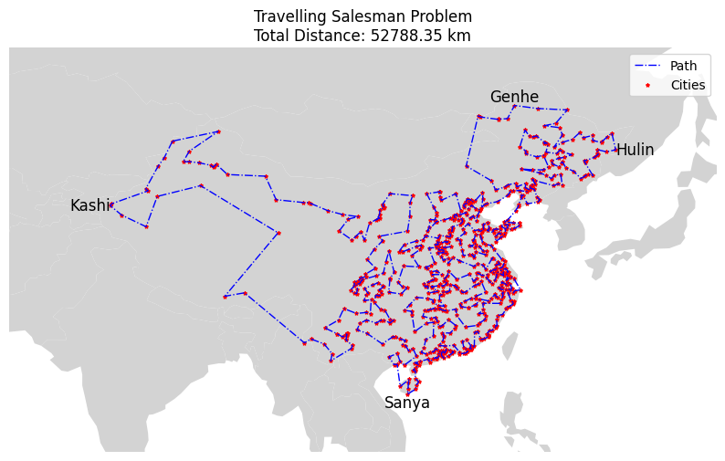

# Traveling salesman problem

The aim of this code is to solve the TSP problem.

### Greedy
The greedy algorithm starts from a city and hops to the closest city. There's also a parameter to adjust the probability to hop to the second, third, etc., closest city, which can produce better results.

### Evolutionary
The initial population is composed of several solutions produced with the greedy approach. I've tried several alternatives for the mutation, and `inversion mutation` is the only one that actually works. Different types of crossover don't influence the final result much, but it seems that `cycle crossover` performs better on average. I've run the algorithm multiple times and selected the best performing one.

### Results
#### Best paths

#### Fitness evolution

